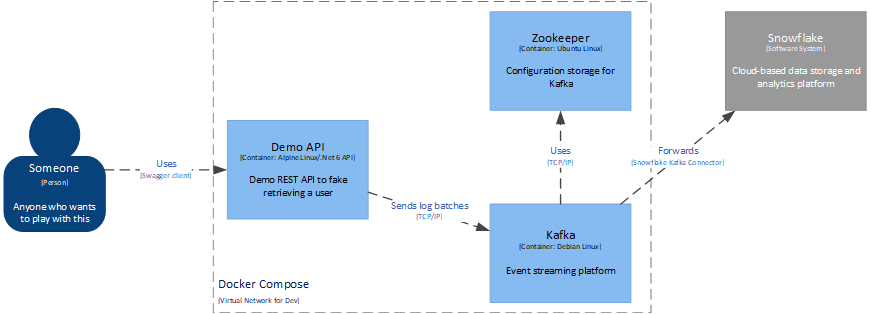
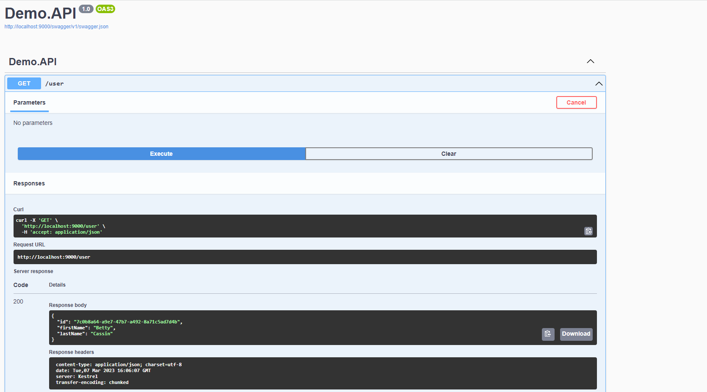
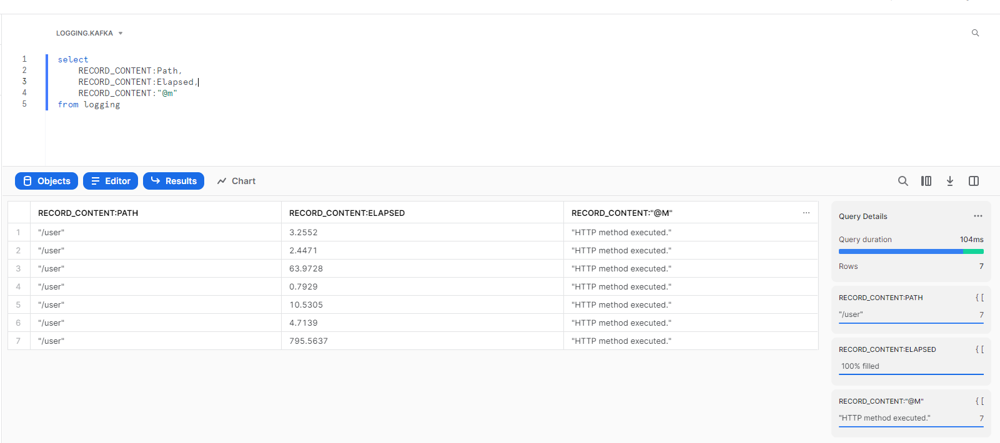

# Extremely Simple Snowflake Logging Demo

Being completely unfamiliar with Snowflake and how it works, I threw this demo application together in a couple of hours as an experiment in integration.

**THIS IS NOT REMOTELY PRODUCTION READY**

Since this was a purely learning exercise, it doesn't contain any:

- Unit, integration, or scenario tests.
- Security controls or encryption.
- Resilience policies.
- Extensive comments.
- Etc.

## Simple Architecture:

This was created and hosted locally in a Docker virtual network configured via docker-compose:

## The Basics:

All this does is stream log events to a Kafka topic, while the Snowflake Kafka Connector ingests them to the specified Snowflake database.

There are configuration files to build a custom Kafka Docker image that contains the connector, and starts it after a brief waiting period.

### To Run:
- Add Snowflake credentials to the SF_connect.properties file.
- From the top-level directory, run "docker-compose up --build"
- The Swagger UI is located at http://localhost:9000/swagger

  #### API:
  

  #### Results:
  

## What's Next:

There's quite a bit I'd like deep dive into regarding their architecture, and if there are any advantages in using separate S3 instances instead of theirs.

Technically, I'd really like to discern how they're utilizing the warehouse clusters for querying. Especially how they're distributing workloads out to members (Hadoop-style within a database? Only between databases?).